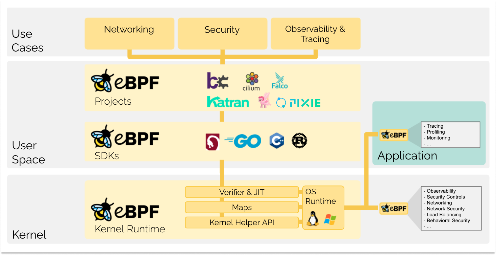
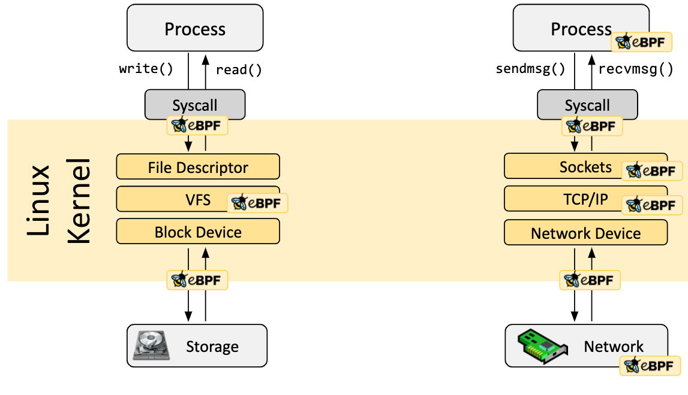
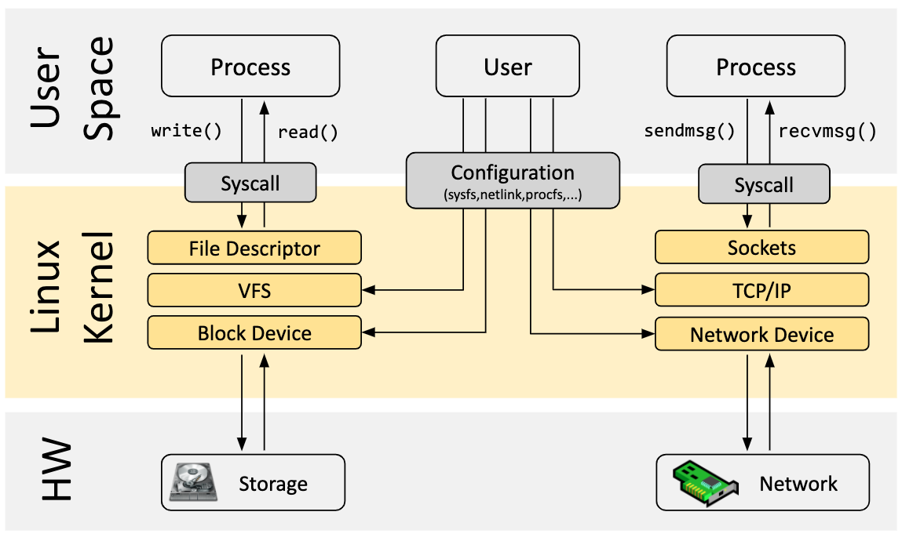

## 什么是 eBPF ？

eBPF 是一项革命性的技术，起源于 Linux 内核，它可以在特权上下文中（如操作系统内核）运行沙盒程序。它用于安全有效地扩展内核的功能，而无需通过更改内核源代码或加载内核模块的方式来实现。

从历史上看，由于内核具有监督和控制整个系统的特权，操作系统一直是实现可观测性、安全性和网络功能的理想场所。同时，由于操作系统内核的核心地位和对稳定性和安全性的高要求，操作系统内核很难快速迭代发展。因此在传统意义上，与在操作系统本身之外实现的功能相比，操作系统级别的创新速度要慢一些。

eBPF 从根本上改变了这个方式。通过允许在操作系统中运行沙盒程序的方式，应用程序开发人员可以运行 eBPF 程序，以便在运行时向操作系统添加额外的功能。然后在 JIT 编译器和验证引擎的帮助下，操作系统确保它像本地编译的程序一样具备安全性和执行效率。这引发了一股基于 eBPF 的项目热潮，它们涵盖了广泛的用例，包括下一代网络实现、可观测性和安全功能等领域。

如今，eBPF 被广泛用于驱动各种用例：在现代数据中心和云原生环境中提供高性能网络和负载均衡，以低开销提取细粒度的安全可观测性数据，帮助应用程序开发人员跟踪应用程序，为性能故障排查、预防性的安全策略执行(包括应用层和容器运行时)提供洞察，等等。可能性是无限的，eBPF 开启的创新才刚刚开始。

### 什么是 eBPF.io ？

eBPF.io 是学习和协作 eBPF 的地方。eBPF 是一个开放的社区，每个人都可以参与和分享。无论您是想阅读第一个介绍 eBPF 文档，或是寻找进一步的阅读材料，还是迈出成为大型 eBPF 项目贡献者的第一步，eBPF.io 将一路帮助你。

### eBPF 和 BPF 分别代表什么 ？

BPF 最初代表伯克利包过滤器 (Berkeley Packet Filter)，但是现在 eBPF(extended BPF) 可以做的不仅仅是包过滤，这个缩写不再有意义了。eBPF 现在被认为是一个独立的术语，不代表任何东西。在 Linux 源代码中，术语 BPF 持续存在，在工具和文档中，术语 BPF 和 eBPF 通常可以互换使用。最初的 BPF 有时被称为 cBPF(classic BPF)，用以区别于 eBPF。

### 标志里面的蜜蜂叫什么名字 ？

蜜蜂是 eBPF 的官方标志，最初是由 Vadim Shchekoldin 设计的。在第一届 [eBPF 峰会](https://ebpf.io/summit-2020.html)上进行了投票，并将蜜蜂命名为 eBee。(有关徽标可接受使用的详细信息，请参阅 Linux 基金会[品牌指南](https://linuxfoundation.org/brand-guidelines/)。)

## eBPF 简介

下面的章节是对 eBPF 的快速介绍。如果您想了解更多关于 eBPF 的信息，请参阅 [eBPF & XDP 参考指南](https://cilium.readthedocs.io/en/stable/bpf/)。无论您是希望构建 eBPF 程序的开发人员，还是对 eBPF 的解决方案感兴趣，了解这些基本概念和体系结构都是有帮助的。

### 钩子概览

eBPF 程序是事件驱动的，当内核或应用程序通过某个钩子点时运行。预定义的钩子包括系统调用、函数入口/退出、内核跟踪点、网络事件等。

如果预定义的钩子不能满足特定需求，则可以创建内核探针（kprobe）或用户探针（uprobe），以便在内核或用户应用程序的几乎任何位置附加 eBPF 程序。

### 如何编写 eBPF 程序 ？

在很多情况下，eBPF 不是直接使用，而是通过像 [Cilium](https://ebpf.io/projects/#cilium)、[bcc](https://ebpf.io/projects/#bcc) 或 [bpftrace](https://ebpf.io/projects/#bpftrace) 这样的项目间接使用，这些项目提供了 eBPF 之上的抽象，不需要直接编写程序，而是提供了指定基于意图的来定义实现的能力，然后用 eBPF 实现。

如果不存在更高层次的抽象，则需要直接编写程序。Linux 内核期望 eBPF 程序以字节码的形式加载。虽然直接编写字节码当然是可能的，但更常见的开发实践是利用像 [LLVM](https://llvm.org/) 这样的编译器套件将伪 c 代码编译成 eBPF 字节码。

### 加载器和校验架构

确定所需的钩子后，可以使用 bpf 系统调用将 eBPF 程序加载到 Linux 内核中。这通常是使用一个可用的 eBPF 库来完成的。下一节将介绍一些开发工具链。

当程序被加载到 Linux 内核中时，它在被附加到所请求的钩子上之前需要经过两个步骤：

### 验证

验证步骤用来确保 eBPF 程序可以安全运行。它可以验证程序是否满足几个条件，例如：

- 加载 eBPF 程序的进程必须有所需的能力（特权）。除非启用非特权 eBPF，否则只有特权进程可以加载 eBPF 程序。
- eBPF 程序不会崩溃或者对系统造成损害。
- eBPF 程序一定会运行至结束（即程序不会处于循环状态中，否则会阻塞进一步的处理）。

### JIT 编译

JIT (Just-in-Time) 编译步骤将程序的通用字节码转换为机器特定的指令集，用以优化程序的执行速度。这使得 eBPF 程序可以像本地编译的内核代码或作为内核模块加载的代码一样高效地运行。

### Maps

eBPF 程序的其中一个重要方面是共享和存储所收集的信息和状态的能力。为此，eBPF 程序可以利用 eBPF maps 的概念来存储和检索各种数据结构中的数据。eBPF maps 既可以从 eBPF 程序访问，也可以通过系统调用从用户空间中的应用程序访问。

下面是支持的 map 类型的不完整列表，它可以帮助理解数据结构的多样性。对于各种 map 类型，共享的或 per-CPU 的变体都支持。

- 哈希表，数组
- LRU (Least Recently Used) 算法
- 环形缓冲区
- 堆栈跟踪
  LPM (Longest Prefix match)算法
- ...

### Helper 调用

eBPF 程序不直接调用内核函数。这样做会将 eBPF 程序绑定到特定的内核版本，会使程序的兼容性复杂化。而对应地，eBPF 程序改为调用 helper 函数达到效果，这是内核提供的通用且稳定的 API。

可用的 helper 调用集也在不断发展迭代中。一些 helper 调用的示例:

- 生成随机数
- 获取当前时间日期
- eBPF map 访问
- 获取进程 / cgroup 上下文
- 操作网络数据包及其转发逻辑

### 尾调用和函数调用

eBPF 程序可以通过尾调用和函数调用的概念来组合。函数调用允许在 eBPF 程序内部完成定义和调用函数。尾调用可以调用和执行另一个 eBPF 程序并替换执行上下文，类似于 execve() 系统调用对常规进程的操作方式。

### eBPF 安全

_能力越大责任越大。_

eBPF 是一项非常强大的技术，并且现在运行在许多关键软件基础设施组件的核心位置。在 eBPF 的开发过程中，当考虑将 eBPF 包含到 Linux 内核中时，eBPF 的安全性是最关键的方面。eBPF 的安全性是通过几层来保证的：

#### 需要的特权

除非启用了非特权 eBPF，否则所有打算将 eBPF 程序加载到 Linux 内核中的进程必须以特权模式 (root) 运行，或者需要授予 CAP_BPF 权限 (capability)。这意味着不受信任的程序不能加载 eBPF 程序。

如果启用了非特权 eBPF，则非特权进程可以加载某些 eBPF 程序，这些程序的功能集减少，并且对内核的访问将会受限。

#### 验证器

如果一个进程被允许加载一个 eBPF 程序，那么所有的程序仍然要通过 eBPF 验证器。eBPF 验证器确保程序本身的安全性。这意味着，例如：

- 程序必须经过验证以确保它们始终运行到完成，例如一个 eBPF 程序通常不会阻塞或永远处于循环中。eBPF 程序可能包含所谓的有界循环，但只有当验证器能够确保循环包含一个保证会变为真的退出条件时，程序才能通过验证。
- 程序不能使用任何未初始化的变量或越界访问内存。
- 程序必须符合系统的大小要求。不可能加载任意大的 eBPF 程序。
- 程序必须具有有限的复杂性。验证器将评估所有可能的执行路径，并且必须能够在配置的最高复杂性限制范围内完成分析。

验证器是一种安全工具，用于检查程序是否可以安全运行。它不是一个检查程序正在做什么的安全工具。

#### 加固

在成功完成验证后，eBPF 程序将根据程序是从特权进程还是非特权进程加载而运行一个加固过程。这一步包括：

- **程序执行保护**： 内核中保存 eBPF 程序的内存受到保护并变为只读。如果出于任何原因，无论是内核错误还是恶意操作，试图修改 eBPF 程序，内核将会崩溃，而不是允许它继续执行损坏/被操纵的程序。
- **缓解 Spectre 漏洞**： 根据推断，CPU 可能会错误地预测分支并留下可观察到的副作用，这些副作用可以通过旁路（side channel）提取。举几个例子: eBPF 程序可以屏蔽内存访问，以便在临时指令下将访问重定向到受控区域，验证器也遵循仅在推测执行（speculative execution）下可访问的程序路径，JIT 编译器在尾调用不能转换为直接调用的情况下发出 Retpoline。
- **常量盲化（Constant blinding）**：代码中的所有常量都是盲化的，以防止 JIT 喷射攻击。这可以防止攻击者将可执行代码作为常量注入，在存在另一个内核错误的情况下，这可能允许攻击者跳转到 eBPF 程序的内存部分来执行代码。

#### 抽象出来的运行时上下文

eBPF 程序不能直接访问任意内核内存。必须通过 eBPF helper 函数来访问程序上下文之外的数据和数据结构。这保证了一致的数据访问，并使任何此类访问受到 eBPF 程序的特权的约束，例如，如果可以保证修改是安全的，则允许运行的 eBPF 程序修改某些数据结构的数据。eBPF 程序不能随意修改内核中的数据结构。

## 为什么使用 eBPF ？

### 可编程性的力量

让我们从一个类比开始。你还记得 GeoCities 吗? 20 年前，网页几乎完全由静态标记语言（HTML）编写。网页基本上是一个文档，有一个应用程序（浏览器）可以显示它。看看今天的网页，网页已经成为成熟的应用程序，基于 web 的技术已经取代了绝大多数用需要编译的语言所编写的应用程序。是什么促成了这种演进 ？

简短的回答是通过引入 JavaScript 实现可编程性。它开启了一场巨大的革命，导致浏览器几乎演变成一个独立的操作系统。

为什么会发生这个演进 ？程序员不再受制于运行特定浏览器版本的用户。提升必要构建模块的可用性，将底层浏览器的创新速度与运行在其上的应用程序解耦开来，而不是去说服标准机构需要一个新的 HTML 标签。这当然有点过于简化这个过程中的变化了，因为 HTML 确实随着时间的推移而一直发展，并对这个演进的成功做出了贡献，但 HTML 本身的发展还不足够满足需求。

在将这个示例应用于 eBPF 之前，让我们先看一下在引入 JavaScript 过程中的几个关键方面：

- **安全**：不受信任的代码在用户的浏览器中运行。这个问题通过沙箱 JavaScript 程序和抽象对浏览器数据的访问来解决。
- **持续交付**：程序逻辑的演进必须能够在不需要不断发布新浏览器版本的情况下实现。通过提供适当的底层构建模块来构建任意逻辑，解决了这个问题。
- **性能**：必须以最小的开销提供可编程性。这个问题通过引入即时（JIT）编译器得到了解决。由于同样的原因，上述所有方面都可以在 eBPF 中找到完全对应的内容。

### eBPF 对 Linux 内核的影响

现在让我们回到 eBPF。为了理解 eBPF 对 Linux 内核的可编程性的影响，有必要对 Linux 内核的体系结构及其与应用程序和硬件的交互方式有一个高层次的了解。

Linux 内核的主要目的是对硬件或虚拟硬件进行抽象，并提供一致的 API（系统调用），允许应用程序运行和共享资源。为了实现这一点，内核维护了一组广泛的子系统和层来分配这些职责。每个子系统通常允许某种级别的配置，以满足用户的不同需求。如果无法配置所需的行为，则需要更改内核，从历史上看，只剩下两个选项：

<CardsList>

<CardItem title="原生支持">

1. 更改内核源代码并使 Linux 内核社区相信改动是有必要的。
2. 等待几年后，新的内核才会成为一个通用版本。

</CardItem>

<CardItem title="内核模块">

1. 编写一个内核模块
2. 定期修复它，因为每个内核版本都可能破坏它
3. 由于缺乏安全边界，有可能损坏 Linux 内核

</CardItem>

</CardsList>

有了 eBPF，就有了一个新的选项，它允许重新编程 Linux 内核的行为，而不需要更改内核源代码或加载内核模块。在许多方面，这与 JavaScript 和其他脚本语言解锁系统演进的方式非常相像，对这些系统进行改动的原有方式已经变得困难或昂贵。

## 开发工具链

已经有几个开发工具可以帮助开发和管理 eBPF 程序。它们对应满足用户的不同需求:

#### bcc

BCC 是一个框架，它允许用户编写 python 程序，并将 eBPF 程序嵌入其中。该框架主要用于应用程序和系统的分析/跟踪等场景，其中 eBPF 程序用于收集统计数据或生成事件，而用户空间中的对应程序收集数据并以易理解的形式展示。运行 python 程序将生成 eBPF 字节码并将其加载到内核中。

#### bpftrace

bpftrace 是一种用于 Linux eBPF 的高级跟踪语言，可在较新的 Linux 内核（4.x）中使用。bpftrace 使用 LLVM 作为后端，将脚本编译为 eBPF 字节码，并利用 BCC 与 Linux eBPF 子系统以及现有的 Linux 跟踪功能（内核动态跟踪（kprobes）、用户级动态跟踪（uprobes）和跟踪点）进行交互。bpftrace 语言的灵感来自于 awk、C 和之前的跟踪程序，如 DTrace 和 SystemTap。

#### eBPF Go 语言库

eBPF Go 语言库提供了一个通用的 eBPF 库，它将获取 eBPF 字节码的过程与 eBPF 程序的加载和管理进行了解耦。eBPF 程序通常是通过编写高级语言，然后使用 clang/LLVM 编译器编译成 eBPF 字节码来创建的。

#### libbpf C/C++ 库

libbpf 库是一个基于 C/ c++ 的通用 eBPF 库，它可以帮助解耦将 clang/LLVM 编译器生成的 eBPF 对象文件的加载到内核中的这个过程，并通过为应用程序提供易于使用的库 API 来抽象与 BPF 系统调用的交互。

## 进一步阅读

如果您想了解更多有关 eBPF 的信息，请使用以下附加材料继续阅读：

### 相关文档

- [BPF & XDP Reference Guide](https://cilium.readthedocs.io/en/stable/bpf/), Cilium Documentation, Aug 2020
- [BPF Documentation](https://www.kernel.org/doc/html/latest/bpf/index.html), BPF Documentation in the Linux Kernel
- [BPF Design Q&A](https://git.kernel.org/pub/scm/linux/kernel/git/torvalds/linux.git/tree/Documentation/bpf/bpf_design_QA.rst), FAQ for kernel-related eBPF questions

### 教程

- [Learn eBPF Tracing: Tutorial and Examples](http://www.brendangregg.com/blog/2019-01-01/learn-ebpf-tracing.html), Brendan Gregg's Blog, Jan 2019
- [XDP Hands-On Tutorials](https://github.com/xdp-project/xdp-tutorial), Various authors, 2019
- [BCC, libbpf and BPF CO-RE Tutorials](https://facebookmicrosites.github.io/bpf/blog/), Facebook's BPF Blog, 2020

### 演讲

#### 入门

- [eBPF and Kubernetes: Little Helper Minions for Scaling Microservices](https://www.youtube.com/watch?v=99jUcLt3rSk) ([Slides](https://kccnceu20.sched.com/event/ZemQ/ebpf-and-kubernetes-little-helper-minions-for-scaling-microservices-daniel-borkmann-cilium)), Daniel Borkmann, KubeCon EU, Aug 2020
- [eBPF - Rethinking the Linux Kernel](https://www.infoq.com/presentations/facebook-google-bpf-linux-kernel/) ([Slides](https://docs.google.com/presentation/d/1AcB4x7JCWET0ysDr0gsX-EIdQSTyBtmi6OAW7bE0jm0)), Thomas Graf, QCon London, April 2020
- [BPF as a revolutionary technology for the container landscape](https://www.youtube.com/watch?v=U3PdyHlrG1o&t=7) ([Slides](https://fosdem.org/2020/schedule/event/containers_bpf/attachments/slides/4122/export/events/attachments/containers_bpf/slides/4122/BPF_as_a_revolutionary_technology_for_the_container_landscape.pdf)), Daniel Borkmann, FOSDEM, Feb 2020
- [BPF at Facebook](https://www.youtube.com/watch?v=ZYBXZFKPS28), Alexei Starovoitov, Performance Summit, Dec 2019
- [BPF: A New Type of Software](https://youtu.be/7pmXdG8-7WU?t=8) ([Slides](https://www.slideshare.net/brendangregg/um2019-bpf-a-new-type-of-software)), Brendan Gregg, Ubuntu Masters, Oct 2019
- [The ubiquity but also the necessity of eBPF as a technology](https://www.youtube.com/watch?v=mFxs3VXABPU), David S. Miller, Kernel Recipes, Oct 2019

#### 深入研究

- [BPF and Spectre: Mitigating transient execution attacks](https://www.youtube.com/watch?v=6N30Yp5f9c4) ([Slides](https://ebpf.io/summit-2021-slides/eBPF_Summit_2021-Keynote-Daniel_Borkmann-BPF_and_Spectre.pdf))
  , Daniel Borkmann, eBPF Summit, Aug 2021
- [BPF Internals](https://www.usenix.org/conference/lisa21/presentation/gregg-bpf) ([Slides](https://www.usenix.org/system/files/lisa21_slides_gregg_bpf.pdf)), Brendan Gregg, USENIX LISA, Jun 2021

#### Cilium

- [Advanced BPF Kernel Features for the Container Age](https://www.youtube.com/watch?v=PJY-rN1EsVw) ([Slides](https://fosdem.org/2021/schedule/event/containers_ebpf_kernel/attachments/slides/4358/export/events/attachments/containers_ebpf_kernel/slides/4358/Advanced_BPF_Kernel_Features_for_the_Container_Age_FOSDEM.pdf)), Daniel Borkmann, FOSDEM, Feb 2021
- [Kubernetes Service Load-Balancing at Scale with BPF & XDP](https://www.youtube.com/watch?v=UkvxPyIJAko&t=21s) ([Slides](https://linuxplumbersconf.org/event/7/contributions/674/attachments/568/1002/plumbers_2020_cilium_load_balancer.pdf)), Daniel Borkmann & Martynas Pumputis, Linux Plumbers, Aug 2020
- [Liberating Kubernetes from kube-proxy and iptables](https://www.youtube.com/watch?v=bIRwSIwNHC0) ([Slides](https://docs.google.com/presentation/d/1cZJ-pcwB9WG88wzhDm2jxQY4Sh8adYg0-N3qWQ8593I/edit#slide=id.g7055f48ba8_0_0)), Martynas Pumputis, KubeCon US 2019
- [Understanding and Troubleshooting the eBPF Datapath in Cilium](https://www.youtube.com/watch?v=Kmm8Hl57WDU) ([Slides](https://static.sched.com/hosted_files/kccncna19/20/eBPF%20and%20the%20Cilium%20Datapath.pdf)), Nathan Sweet, KubeCon US 2019
- [Transparent Chaos Testing with Envoy, Cilium and BPF](https://www.youtube.com/watch?v=gPvl2NDIWzY) ([Slides](https://static.sched.com/hosted_files/kccnceu19/54/Chaos%20Testing%20with%20Envoy%2C%20Cilium%20and%20eBPF.pdf)), Thomas Graf, KubeCon EU 2019
- [Cilium - Bringing the BPF Revolution to Kubernetes Networking and Security](https://www.youtube.com/watch?v=QmmId1QEE5k) ([Slides](https://www.slideshare.net/ThomasGraf5/cilium-bringing-the-bpf-revolution-to-kubernetes-networking-and-security)), Thomas Graf, All Systems Go!, Berlin, Sep 2018
- [How to Make Linux Microservice-Aware with eBPF](https://www.youtube.com/watch?v=_Iq1xxNZOAo) ([Slides](https://www.slideshare.net/InfoQ/how-to-make-linux-microserviceaware-with-cilium-and-ebpf)), Thomas Graf, QCon San Francisco, 2018
- [Accelerating Envoy with the Linux Kernel](https://www.youtube.com/watch?v=ER9eIXL2_14), Thomas Graf, KubeCon EU 2018
- [Cilium - Network and Application Security with BPF and XDP](https://www.youtube.com/watch?v=ilKlmTDdFgk) ([Slides](https://www.slideshare.net/ThomasGraf5/dockercon-2017-cilium-network-and-application-security-with-bpf-and-xdp)), Thomas Graf, DockerCon Austin, Apr 2017

#### Hubble

- [Hubble - eBPF Based Observability for Kubernetes](https://static.sched.com/hosted_files/kccnceu20/1b/Aug19-Hubble-eBPF_Based_Observability_for_Kubernetes_Sebastian_Wicki.pdf), Sebastian Wicki, KubeCon EU, Aug 2020

### 书籍

- [Learning eBPF](https://isovalent.com/books/learning-ebpf/?utm_source=website-ebpf&utm_medium=referral&utm_campaign=partner), Liz Rice, O'Reilly, 2023
- [Security Observability with eBPF](https://isovalent.com/books/ebpf-security/?utm_source=website-ebpf&utm_medium=referral&utm_campaign=partner), Natália Réka Ivánkó and Jed Salazar, O'Reilly, 2022
- [What is eBPF?](https://isovalent.com/books/ebpf/?utm_source=website-ebpf&utm_medium=referral&utm_campaign=partner), Liz Rice, O'Reilly, 2022
- [Systems Performance: Enterprise and the Cloud, 2nd Edition](http://www.brendangregg.com/systems-performance-2nd-edition-book.html), Brendan Gregg, Addison-Wesley Professional Computing Series, 2020
- [BPF Performance Tools](http://www.brendangregg.com/bpf-performance-tools-book.html), Brendan Gregg, Addison-Wesley Professional Computing Series, Dec 2019
- [Linux Observability with BPF](https://www.oreilly.com/library/view/linux-observability-with/9781492050193/), David Calavera, Lorenzo Fontana, O'Reilly, Nov 2019

### 文章和博客

- [BPF for security - and chaos - in Kubernetes](https://lwn.net/Articles/790684/), Sean Kerner, LWN, Jun 2019
- [Linux Technology for the New Year: eBPF](https://thenewstack.io/linux-technology-for-the-new-year-ebpf/), Joab Jackson, Dec 2018
- [A thorough introduction to eBPF](https://lwn.net/Articles/740157/), Matt Fleming, LWN, Dec 2017
- [Cilium, BPF and XDP](https://opensource.googleblog.com/2016/11/cilium-networking-and-security.html), Google Open Source Blog, Nov 2016
- [Archive of various articles on BPF](https://lwn.net/Kernel/Index/#Berkeley_Packet_Filter), LWN, since Apr 2011
- [Various articles on BPF by Cloudflare](https://blog.cloudflare.com/tag/ebpf/), Cloudflare, since March 2018
- [Various articles on BPF by Facebook](https://facebookmicrosites.github.io/bpf/blog/), Facebook, since August 2018
